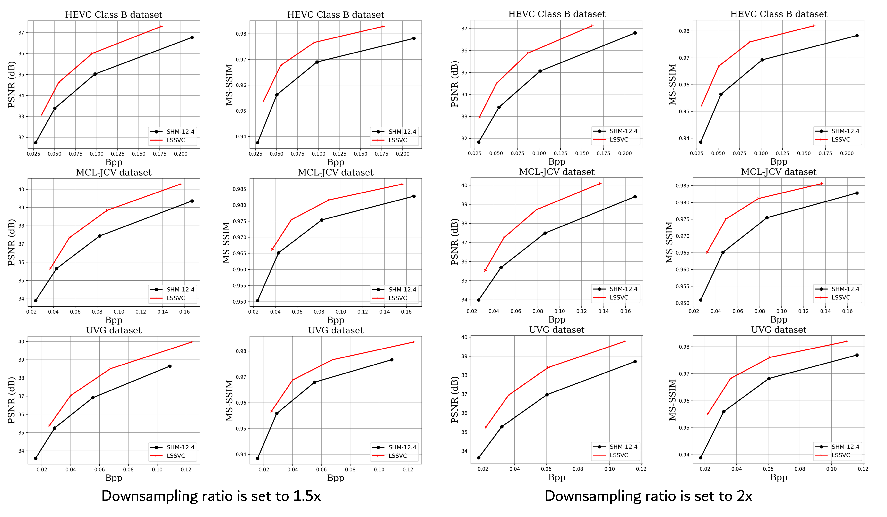
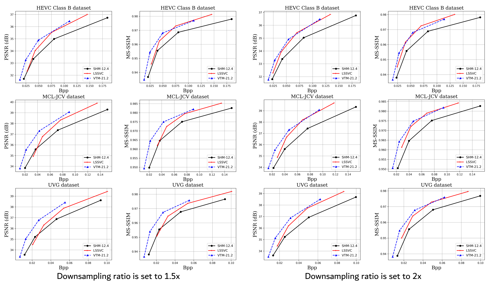

## LSSVC: A Learned Spatially Scalable Video Coding Scheme

Official Pytorch implementation for [LSSVC: A Learned Spatially Scalable Video Coding Scheme ](https://ieeexplore.ieee.org/document/10521480)

### News :loudspeaker:
- We have added the evaluation w/o real bitstream writing!


### Prerequisites
- Python 3.6
- CUDA if want to use GPU for acceleration
- cudatoolkit=11.3
- pytorch==1.10.1
- torchvision==0.11.2
- pytorch-msssim==0.2.1
- bd-metric==0.9.0

### Build the project
We provide the test script with real bitstream writing. Please build the C++ code to test with real bitstream writing. 


Set the `--write_stream 1` to make real coding. There is little difference between the real bitrates and estimated bitrates.
#### On Linux
```bash
sudo apt-get install cmake g++
cd src
mkdir build
cd build
conda activate $YOUR_PY36_ENV_NAME
cmake ../cpp -DCMAKE_BUILD_TYPE=Release
make -j
```

### Comparing with other method
- RD curve with intra period 12



- RD curve with intra period 32



### Pretrained models
We provide [our pretrained models](https://drive.google.com/drive/folders/1VMEYeL6vSDmYmHYa47iLBRn2vQnrziwA?usp=sharing):
- Scalable Intra models (IntraSS)
- Scalable Inter models (LSSVC)

IntraSS is a degraded version of LSSVC without interframe references.

### Command Lines
We provide the command lines of the encoder and decoder of 
HM-18.0, VTM-21.2, and SHM. The VTM-21.2 is utilized for both 
simulcast coding and two-layer scalable coding in our experiments.
#### simulcast coding
For simulcast encoding and decoding, it involves performing two separate single-layer encoding and decoding processes.
Here, we summarize the command lines used for single-layer coding.
- HM-18.0 Encoder
```text
TAppEncoder
-c encoder_lowdelay_main.cfg
--IntraPeriod={intra period}
--FramesToBeEncoded=96
--InputFile={input file name}
--FrameRate={frame rate}
--SourceWidth={width}
--SourceHeight={height}
--InputBitDepth=8
--InputChromaFormat=420
--DecodingRefreshType=2
--ConformanceWindowMode=1
--QP={qp}
--BitstreamFile={bitstream file name}
```
- HM-18.0 Decoder
```text
TAppDecoder 
-b {bitstream file name}
-o {reconstructed file name}
```
- VTM-21.2 Encoder
```text
EncoderApp
-c encoder_lowdelay_vtm.cfg
--IntraPeriod={intra period}
--FramesToBeEncoded=96
--InputFile={input file name}
--FrameRate={frame rate}
--SourceWidth={width}
--SourceHeight={height}
--InputBitDepth=8
--InputChromaFormat=420
--DecodingRefreshType=2
--OutputBitDepth=8
--QP={qp}
--BitstreamFile={bitstream file name}
```
- VTM-21.2 Decoder
```text
DecoderApp 
-b {bitstream file name}
-o {reconstructed file name}
```


#### two-layer coding
- SHM-12.4 Encoder
```text
TAppEncoder
-c encoder_lowdelay_scalable.cfg
-c layers.cfg
--IntraPeriod0={intra period of layer0}
--InputFile0={input file name of layer0}
--FrameRate0={frame rate of layer0}
--SourceWidth0={width of layer0}
--SourceHeight0={height of layer0}
--QP0={qp of layer0}
--IntraPeriod1={intra period of layer1}
--InputFile1={input file name of layer1}
--FrameRate1={frame rate of layer1}
--SourceWidth1={width of layer1}
--SourceHeight1={height of layer1}
--QP1={qp of layer1}
--FramesToBeEncoded=96
--InputBitDepth=8
--InputChromaFormat=420
--DecodingRefreshType=2
--BitstreamFile={bitstream file name}
```
- SHM-12.4 Decoder
```text
TAppDecoder 
-b {bitstream file name}
-o {reconstructed file name}
```
- VTM-21.2 Encoder
```text
EncoderApp
-c encoder_lowdelay_vtm.cfg
-c two-layers.cfg
-l0 --FrameRate={frame rate of layer0}
-l0 --FramesToBeEncoded=96
-l0 --IntraPeriod={intra period of layer0}
-l0 --SourceWidth={width of layer0}
-l0 --SourceHeight={height of layer0}
-l0 --OutputBitDepth=8
-l0 --InputFile={input file name}
-l0 --QP={qp of layer0}
-l1 --FrameRate={frame rate of layer1}
-l1 --FramesToBeEncoded=96
-l1 --IntraPeriod={intra period of layer1}
-l1 --SourceWidth={width of layer1}
-l1 --SourceHeight={height of layer1}
-l1 --OutputBitDepth=8
-l1 --InputFile={input file name}
-l1 --QP={qp of layer1}
--BitstreamFile={bitstream file name}
```
- VTM-21.2 Decoder
```text
DecoderApp 
-b {bitstream file name}
-o {reconstructed file name}
```

### Citation
If you find our work useful for your research, please cite:
```
@ARTICLE{10521480,
  author={Bian, Yifan and Sheng, Xihua and Li, Li and Liu, Dong},
  journal={IEEE Transactions on Image Processing}, 
  title={LSSVC: A Learned Spatially Scalable Video Coding Scheme}, 
  year={2024},
  volume={33},
  number={},
  pages={3314-3327},
  doi={10.1109/TIP.2024.3395025}}
```
